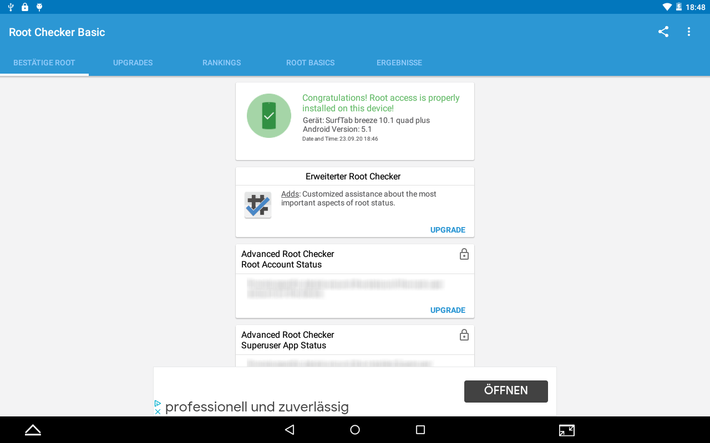

# How to root SurfTab breeze 10.1 quad plus (ST10408-11)

## Using Arch Linux (5.8.6-arch1-1) in September 2020  


### 1.) Creating the scatter file

Activate **USB debugging** within **[Developer options](https://developer.android.com/studio/debug/dev-options)** of the device.  
Connect the Tablet via a micro USB cable, that can transport data, to your Computer.
Get general product infos by running `adb shell getprop | grep product` in a terminal emulator:
```
[i.product]: [SurfTab]
[ro.build.product]: [htt8127_tb_l1]
[ro.product.board]: [ST10408-11]
[ro.product.brand]: [TrekStor]
[ro.product.chivinproduct]: [ST10408-11]
[ro.product.chivinversion]: [ST10408-11_20160304_V1.1.8]
[ro.product.cpu.abi2]: [armeabi]
[ro.product.cpu.abi]: [armeabi-v7a]
[ro.product.cpu.abilist32]: [armeabi-v7a,armeabi]
[ro.product.cpu.abilist64]: []
[ro.product.cpu.abilist]: [armeabi-v7a,armeabi]
[ro.product.device]: [ST10408-11]
[ro.product.facebook.dash]: [true]
[ro.product.locale.language]: [en]
[ro.product.locale.region]: [US]
[ro.product.manufacturer]: [TrekStor]
[ro.product.model]: [SurfTab breeze 10.1 quad plus]
[ro.product.name]: [ST10408-11]
[ro.product.number]: [ST10408-11]
[ro.product.ota.host]: [update.ktc.cn:2400]
[ro.product.production_list]: [SDA002]
[ro.product.version]: [1.0.0]
```
`adb shell getprop | grep platform`:
```
[ro.board.platform]: [mt8127]
[ro.mediatek.platform]: [MT8127]
```
*(Note that different devices from different vendors may not use some strings or may use other strings)*

Since this device has an MTK processor, **spflashtool-bin** (Smart Phone Flash Tool) can be used to create a full backup (you won't find a stock firmware for this device → **TAKE A BACKUP**).
You will need a **scatter file** for MTK devices to be able to be able to read from or write to partitions of your device. In this case, search for scatter files that are created for other devices that use the **MT8127** chipset and add missing infos.

You can use `adb pull /proc/dumchar_info` to get info about needed partitions, where they start and how big they are (see [dumchar_info](dumchar_info)). 

You can also get some other partition info via `adb pull /proc/partitions` (see [partitions](partitions)), but in the end, I haven't used that.

We can't just use the scatter file of the **SurfTab breeze 10.1 quad** since we have additional partitions and some addresses are different, but we can use it as a [base](https://forum.xda-developers.com/attachment.php?attachmentid=3233140&d=1427546951).

Compared to the scatter file of the non-plus version, I added **EBR2** (based off [this](http://docs15.chomikuj.pl/5046787909,PL,0,0,MT8127_Android_scatter_mod.txt)) and **FRP** (based off [this](https://forum.xda-developers.com/showpost.php?p=67853030&postcount=8)) as partitions. Until partition index SYS14 (that's where EBR2 starts), the scatter files of both devices are the same.

linear_start_addr and physical_start_addr seem to be usually the same, but for **BMTPOOL** I decided against that rule thumb since most scatter files seem to use **0xFFFF00a8** as the linear_start_addr here..

**Please not that I'm not an expert of scatter files, so my scatter file might have some mistakes. I haven't found any good documentation about them. Also, this is the first device that I needed to create a scatter file by myself for**
(final [scatter file](MT8127_Android_scatter_trekstor_surftab_quad_101_plus.txt)).  


### 2.) Backup partitions & verify them

To take backups of partitions, you may want to change set `ShowByScatter=true` within `/opt/spflashtool/option.ini` since **Smart Phone Flash Tool** will then show all partitions you can **Read Back** within the **Readback** tab. Turn off your Tablet and just save them all. Maybe also make a backup without that option and save the region until the cache partition. [You can also somehow extract the preloader from that backup](https://www.android-hilfe.de/forum/anleitungen-fuer-mediatek-geraete.2400/anleitung-backup-readback-per-sp-flash-tool.746503.html), but I haven't looked into that so far.
If you saved all 24 partitions individually as e.g. ROM_0 to ROM_23, then you can check wether everything looks right by mounting the backups of the **ext4 partitions** whose names you get from `adb shell cat /proc/mounts | grep ext4`:
```
/emmc@android /system ext4 ro,seclabel,relatime,data=ordered 0 0
/emmc@usrdata /data ext4 rw,seclabel,nosuid,nodev,noatime,discard,noauto_da_alloc,data=ordered 0 0
/emmc@cache /cache ext4 rw,seclabel,nosuid,nodev,noatime,discard,noauto_da_alloc,data=ordered 0 0
```
To mount those partition backups, you can use **[loop devices](https://en.wikipedia.org/wiki/Loop_device)**:
```
sudo losetup /dev/loop111 ROM_23
sudo mount /dev/loop111 /mnt
```
(Note that there is a `bootanimation.zip` on one of those partitions, which may be replaceable, if you want another boot animation)  
When done:
```
sudo umount /mnt
sudo losetup -d /dev/loop111
```

Other partitions, like the **BOOTIMG** partition, can not be mounted that easily but extracted. You can just rename it to `boot.img` and use `unpack-MTK.pl` from [mtk-tools](https://github.com/bgcngm/mtk-tools) to extract the image.
Within the new `boot.img-ramdisk` you could check wether some files have plausible content. E.g. `MMSBrandingID` has `TrekStor_1234_440_-1` and `fstab` has 
```
# Android fstab file.
#<src>           <mnt_point>         <type>    <mnt_flags and options>                 <fs_mgr_flags>
# The filesystem that contains the filesystem checker binary (typically /system) cannot
# specify MF_CHECK, and must come before any filesystems that do specify MF_CHECK

/emmc@usrdata     /data               ext4      noatime,nosuid,nodev,noauto_da_alloc    wait,check,encryptable=footer
/emmc@protect_f   /protect_f          ext4      noatime,nosuid,nodev,noauto_da_alloc    wait,check
/emmc@protect_s   /protect_s          ext4      noatime,nosuid,nodev,noauto_da_alloc    wait,check
/devices/platform/mtk-msdc.0/mmc_host   auto      vfat      defaults        voldmanaged=sdcard0:emmc@fat,noemulatedsd
/devices/platform/mtk-msdc.1/mmc_host   auto      vfat      defaults        voldmanaged=sdcard1:auto
/devices/platform/mt_usb                auto      vfat      defaults        voldmanaged=usbotg:auto
```
which seems to look fine for me.  


### 3.) Flashing & patching (to gain root rights)

This is just some paranoia at this point, but to be extra safe, I did not flash `boot.img` at first but the `usrdata.img` (renamed partition backup) to **USRDATA** just to verfiy that the flashing works.  
Within the **Smart Phone Flash Tool**, you just switch to the **Download** tab, load your scatter file via **Scatter-loading File**, click on the **Location** field in the row of the correct partition, check the checkbox next to it and then press the **Download** button with the green arrow. Turn your tablet off to start the process.

To finally root your device, you can use **Magisk** to [patch the `boot.img`](https://topjohnwu.github.io/Magisk/install.html#boot-image-patching).  

**Please note, that there is no custom recovery like TWRP for this device and also no custom ROM at this point.**
### Kernel sources would make this easier, but sadly Trekstor doesn't seem to have published them for this device on [their website](https://www.trekstor.de/opensource.html). Maybe write them a e-mail, a postcard or just call them ([their imprint](https://www.trekstor.de/imprint.html)), since they need to publish those according to licenses.

**Enjoy your rooted tablet!**


